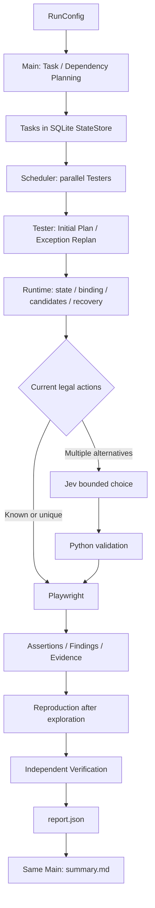

# Multi-Agent Web Testing System

这是一个 Python 网页自动测试项目。用户提供测试目标、账号引用、范围和预期行为，Main Agent 分配任务，多个 Tester Agent 在独立浏览器会话中测试。系统保存真实操作与证据，再复现和验证异常，最后生成报告。

项目只有两种智能体（Agent）：Main 和 Tester。Runtime、Jev、回放和验证都是执行组件。当前默认最多同时运行 3 个 Tester。

## 最终架构



| 组件 | 职责 | 代码入口 |
| --- | --- | --- |
| Main Agent | 规划完整工作流、任务优先级与依赖；必要时重规划；最后只读总结报告 | [main_agent.py](src/web_testing_system/agents/main_agent.py) |
| Tester Agent | 为一个任务提交完整初始计划；异常时只重规划剩余检查 | [tester_agent.py](src/web_testing_system/agents/tester_agent.py) |
| Runtime | 读取页面、绑定输入与原对象、生成合法候选、恢复局部错误、控制预算 | [web_runtime.py](src/web_testing_system/runtime/web_runtime.py) |
| Jev Decision Model | 从当前候选 ID 中做有限选择（Bounded Choice）；不生成操作或选择器 | [jev_selector.py](src/web_testing_system/runtime/jev_selector.py) |
| Playwright | 执行浏览器动作与断言（Assertion），记录真实结果 | [playwright_executor.py](src/web_testing_system/runtime/playwright_executor.py) |
| Scheduler | 按优先级和依赖持续填补空闲执行槽位 | [scheduler.py](src/web_testing_system/orchestration/scheduler.py) |
| Shared State / StateStore | 用 SQLite 保存任务、进度、路径、异常、证据索引、预算和操作历史 | [store.py](src/web_testing_system/state/store.py) |

Harness 是 Microsoft Agent Framework 的 Main 执行外壳，定义受控工具、会话和中间件（Middleware）。Main 关闭内置 Todo、文件记忆和网页搜索，以 SQLite 中的任务作为执行计划。Tester 使用普通 `Agent`，由自己的 Runner 和中间件约束计划执行与结束。Harness 不负责浏览器操作或调度。

每个 Tester 有独立会话（Session）和浏览器上下文（BrowserContext）。多个 Tester 通过 Shared State 协作。完整任务依赖由 Scheduler 等待；需要同时保留登录状态的工作流通过 Runtime 的进度信号（Progress Signal）交接，不互相等待整个任务结束。

更具体的调用顺序和阅读路线见 [架构与数据流](docs/architecture.md)。

## 一次完整测试

1. [orchestration/runner.py](src/web_testing_system/orchestration/runner.py) 校验配置并建立 Run、预算和 Shared State。
2. Main 把目标分为任务。配置有必要检查（Required Check）时，Python 绑定准确的账号、检查 ID、输入引用与依赖，保持连续工作流在同一任务中。
3. Scheduler 启动就绪任务。Tester 提交完整计划；Python 在操作页面前检查输入、目标、检查覆盖与顺序。
4. Runtime 执行业务操作。已知动作或唯一合法动作直接交给 Playwright；多个合法候选交给 Jev，再检查候选是否仍然有效。
5. 实际检查结果、操作历史和证据写入 Shared State。异常阻塞时 Tester 读取当前页面和已完成检查，替换剩余计划。
6. 所有探索结束后，系统处理 Finding、回放与验证，生成 `report.json`。同一个 Main 用无工具的新会话生成 `summary.md`，CLI 输出总结和报告路径。

执行状态 `COMPLETED` 只表示任务执行结束。任务成功（Task Success）还要求必要检查正确完成。缺少检查是 `UNKNOWN`；正确发现并确认应用缺陷可以算测试任务成功。评分统一在 [scoring.py](src/web_testing_system/scoring.py)。

## Finding、Replay 与 Verification

Finding 是记录了预期与实际差异的异常。Tester 不能直接把异常声明为已确认缺陷。

```text
Assertion failure → Finding + Evidence → Screening / Deduplication
→ Reproduction: fresh replay attempts → REPRODUCED
→ Verification: fresh replay against expected behavior
→ CONFIRMED_BUG / CLOSED / NEEDS_CONFIRMATION
```

- [FindingService](src/web_testing_system/findings/service.py) 用明确规则筛选与去重。
- [ReplayPlanBuilder](src/web_testing_system/reproduction/replay.py) 从真实操作历史构建回放，保留身份、输入引用、原对象和必要参与者；不调用模型重新猜步骤。
- 默认复现（Reproduction）需要最多 3 次尝试中的 2 次匹配。之后 [VerificationRunner](src/web_testing_system/verification/runner.py) 独立检查预期行为；实际断言失败才确认缺陷。设置或回放路径失败仍保持不确定。
- [EvidenceStore](src/web_testing_system/evidence/store.py) 保存截图、DOM、网络摘要、控制台错误和回放追踪；SQLite 保存文件索引。探索与回放有独立步数预算。

## 本地启动

在仓库根目录使用 Python 3.13。以下命令使用 PowerShell：

```powershell
py -3.13 -m venv .venv
.\.venv\Scripts\python.exe -m pip install -e ".[dev]"
.\.venv\Scripts\python.exe -m playwright install chromium
Copy-Item .env.example .env
```

在 `.env` 填入 `OPENROUTER_API_KEY`。Main / Tester 使用 OpenRouter；固定模型和供应商见 [.env.example](.env.example)。Tester 仅在主供应商 API 或连接失败时尝试备用模型；Main 备用模型由用户手动切换。可选视觉操作（Computer Use）默认关闭。

启动演示应用（Demo App）：

```powershell
.\.venv\Scripts\python.exe -m demo_app
```

浏览器打开 `http://127.0.0.1:8000`。内置账号为 `admin / demo-admin`、`member / demo-member`、`member2 / demo-member2`。Demo 提供项目、任务、成员与权限流程；B1–B6 缺陷开关默认关闭。开关读取进程环境变量，例如启动前设置 `$env:DEMO_BUG_B1="true"`。测试模式支持 `POST /test/reset`。

另开终端运行一次普通示例测试。这个命令会调用真实模型，不运行正式评估集：

```powershell
$env:DEMO_ADMIN_PASSWORD = "demo-admin"
.\.venv\Scripts\python.exe -m web_testing_system examples/demo_run.json
```

账号密码通过 `env:` 引用在 Runtime 内存中解析。自定义配置请参考 [demo_run.json](examples/demo_run.json) 和 [RunConfig](src/web_testing_system/config.py)；预期行为与测试数据由调用者明确提供。

普通输出位于 `artifacts/runs/<run_id>/`：`report.json` 是确定性测试事实，`summary.md` 是 Main 的文字总结。共享数据库默认位于 `artifacts/state/shared_state.db`。

## 本地测试与检查

```powershell
.\.venv\Scripts\python.exe -m pytest
.\.venv\Scripts\python.exe -m ruff check src tests demo_app evaluation/measure.py
.\.venv\Scripts\python.exe -m mypy src/web_testing_system evaluation/measure.py
git diff --check
```

测试使用替身（Fake / Mock Provider）、临时 SQLite 与本地 Chromium，覆盖单元测试（Unit Test）、集成测试（Integration Test）和浏览器测试（Browser Test）。这些命令不运行真实 LLM Benchmark。

## Evaluation

冻结开发集（Development Set）有 10 个用例、74 个检查；保留集（Holdout）有 8 个用例、66 个检查。场景与标准答案分别保存在 [scenarios.json](evaluation/scenarios.json) 和 [ground_truth.json](evaluation/ground_truth.json)，冻结记录在 [evaluation_v2_freeze.json](evaluation/evaluation_v2_freeze.json)。标准答案只在运行结束后参与评分，不进入 Agent 的任务上下文。

后续明确需要新测量时，统一入口如下。每个用例只派发一次；输出目录必须是新的。运行需要 OpenRouter、LangSmith 凭据和开启追踪（Tracing），会调用真实模型：

```powershell
.\.venv\Scripts\python.exe -m evaluation.measure development artifacts/runs/development-new
.\.venv\Scripts\python.exe -m evaluation.measure holdout artifacts/runs/holdout-new
```

[measure.py](evaluation/measure.py) 启动独立 Demo、配置冻结缺陷、调用 `FormalRunExecutor`，保存配置、文件指纹与测量清单。结果中的有效失败保留，不自动补跑。评分和报告仍使用现有实现。本次 Cleanup 没有运行以上命令。

六种单因素对照路线保留在 [evaluation/runner.py](src/web_testing_system/evaluation/runner.py)。其 `run_full_mode` 需要 `FULL_EVALUATION=true`、显式启用和验收门槛；普通 CLI 和上述单次集合测量不等于这个对照模式。

正式结果已完成，历史数字保持原样：

- [Benchmark History](evaluation/benchmark_history.md)：Baseline、Final Development、Final Holdout 和比较。
- [Final Readiness Summary](evaluation/optimization/final_readiness_summary.md)：当前最终结果与之前阶段记录。
- [Tester](evaluation/optimization/tester_optimization.md)、[Main](evaluation/optimization/main_optimization.md)、[Runtime](evaluation/optimization/runtime_optimization.md)：保留的优化历史。

原始正式结果完整保留在 `artifacts/runs/baseline-v2-20261008-002/`、`final-development-v2-20261010-001/`、`final-holdout-v2-20261010-001/`。被用户中断的 Baseline `baseline-v2-20261008-001/` 也保留来源记录。历史引用的中间测量只保留汇总和核对文件；重复原始调试输出已清理。`artifacts/` 被 Git 忽略，分享项目时需另行保存这些本地正式结果。

## LangSmith Tracing

[observability.py](src/web_testing_system/observability.py) 记录 Run、Main Planning / Replan、Tester Initial Plan / Exception Replan、Jev、浏览器动作、复现、验证与 Main Final Summary。设置 `LANGSMITH_API_KEY` 后可查看；正式真实评估开启追踪，普通运行遵循 `LANGSMITH_TRACING`。

只上传允许的元数据和用量，不上传提示词、工具内容、截图或凭据。追踪连接或上传失败不改变测试结果。

## 主要目录

```text
src/web_testing_system/
  agents/          Main / Tester 与受控工具
  orchestration/   总入口与并行调度
  runtime/         页面状态、候选、Jev、Playwright、预算与权限
  state/           SQLite Shared State
  findings/        异常生命周期
  evidence/        证据文件与索引
  reproduction/    确定性回放与复现
  verification/    独立验证
  reporting/       结构化报告
  evaluation/      评分指标、匹配与对照执行
  config.py / providers.py / scoring.py / observability.py / security.py
demo_app/         本地测试目标与 B1–B6
evaluation/       冻结数据、measure.py、正式历史与 optimization/
tests/            unit/、integration/、browser/
examples/         普通 Demo 运行配置
docs/             architecture.md；history/ 为本地旧计划
artifacts/        本地正式结果与历史汇总，Git 忽略
```
