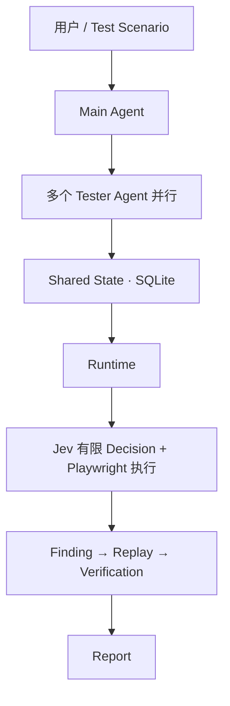

# Multi-Agent 网页自动测试系统

## 项目简介

这是一个基于 Microsoft Agent Framework / Harness 的 Multi-Agent 网页自动测试系统。Main Agent 负责拆分任务、安排依赖并协调执行，多个 Tester Agent 在独立浏览器会话中并行测试，通过 Shared State 共享任务进度、页面状态摘要和测试结果。

Tester 制定 Test Plan，遇到异常时生成剩余任务的 Replan。Runtime + Playwright 负责真实网页执行，Jev 只在有限候选中做 Decision，不负责 Planning。系统发现 Bug 后保存 Evidence，并通过 Replay / Verification 复现和验证，最后生成 Report。

## 核心架构



| 组件 | 一句话职责 |
| --- | --- |
| Main Agent | 拆分任务、安排依赖、协调 Tester，并总结最终结果。 |
| Tester Agent | 为当前任务生成 Test Plan，异常时只 Replan 剩余检查。 |
| Shared State | 保存任务、页面状态摘要和结果，支持多会话协作。 |
| Runtime | 管理页面状态、合法候选、预算和局部恢复。 |
| Jev | 作为 Decision Model 选择当前候选，不做 Planner。 |
| Playwright | 操作真实浏览器，执行测试动作和 Assertion。 |
| Harness | 约束 Main 的工具与会话，支持受控的 Agent 执行流程。 |

Main 规划执行顺序，Python Scheduler 实际派发任务；默认最多 3 个 Tester 并行。Shared State 协调进度，每个 Tester 保留独立浏览器会话。

## 一次测试怎么运行

1. Main 根据目标和 Test Scenario 拆分任务，安排依赖。
2. Scheduler 启动多个就绪的 Tester，各自打开独立浏览器会话。
3. Tester 为当前任务生成完整 Test Plan。
4. Runtime 管理执行，Jev 做有限 Decision，Playwright 操作网页；异常时 Tester Replan。
5. 测试结果和 Evidence 索引写入 Shared State。
6. Finding → Replay → Verification → Report；同一个 Main 总结报告。

## 项目亮点

- Multi-Agent 并行协作。
- Shared State / Multi-session Coordination。
- Harness 驱动的受控执行流程。
- Jev Bounded Decision。
- Playwright Browser Automation。
- Finding / Replay / Verification 闭环。
- LangSmith Tracing。
- Evaluation-driven Optimization。

正式 Development 的 Baseline v2 与 Final Development 比较：

| 核心指标 | Baseline v2 → Final Development |
| --- | --- |
| 任务成功率（Task Success） | 21.43% → 86.67% |
| 端到端成功率（E2E Success） | 10% → 80% |
| 重规划上限停止（Replan Limit Stops） | 11 → 0 |
| 总 Token | 约 1.30M → 0.77M |

Final Development 的 Bug Precision / Recall 均为 **100%**。Final Holdout 的 Bug Precision 为 **100%**，稳定复现率（Reproduction Success）为 **83.33%**。

Development 和 Holdout 是不同评测集，且分别使用修复前、后的代码，不能合并为同一个成功率。Development 的检查完成率为 78.38%，未达到 90% 的最终目标；Holdout 的 E2E Success 为 37.50%。完整结果见 [正式评估记录](evaluation/benchmark_history.md)。

## 技术栈

Python 3.13 · Microsoft Agent Framework / Harness · Playwright · Jev Decision Model · SQLite · LangSmith · OpenRouter。

## 快速开始

在仓库根目录使用 PowerShell，先安装依赖：

```powershell
py -3.13 -m venv .venv
.\.venv\Scripts\python.exe -m pip install -e ".[dev]"
.\.venv\Scripts\python.exe -m playwright install chromium
Copy-Item .env.example .env
```

在 `.env` 中填写 `OPENROUTER_API_KEY`。启用 LangSmith Tracing 时再填写 `LANGSMITH_API_KEY`；模型配置见 [.env.example](.env.example)。

启动 Demo，浏览器打开 `http://127.0.0.1:8000`：

```powershell
.\.venv\Scripts\python.exe -m demo_app
```

另开终端运行一个普通示例，再运行本地测试：

```powershell
$env:DEMO_ADMIN_PASSWORD = "demo-admin"
.\.venv\Scripts\python.exe -m web_testing_system examples/demo_run.json
.\.venv\Scripts\python.exe -m pytest
```

示例会调用真实模型，结果保存为 `artifacts/runs/<run_id>/report.json` 和 `summary.md`。本地测试使用 Fake / Mock Provider 和本地 Chromium。正式 Evaluation 的数据、结果和入口位于 `evaluation/`，不属于上述示例。

## 项目结构

- `src/web_testing_system/`：Agent、Runtime、共享状态与测试闭环。
- `demo_app/`：本地测试目标，包含 B1–B6 缺陷开关。
- `evaluation/`：冻结评测数据、正式结果记录和优化历史。
- `tests/`：单元、集成与浏览器测试。
- `docs/`：详细架构与数据流。
- `examples/`：普通 Demo 运行配置。

## 更多文档

- [docs/architecture.md](docs/architecture.md)：完整架构与数据流。
- [evaluation/benchmark_history.md](evaluation/benchmark_history.md)：正式 Evaluation 结果。
- [evaluation/optimization/](evaluation/optimization/)：优化历史。
